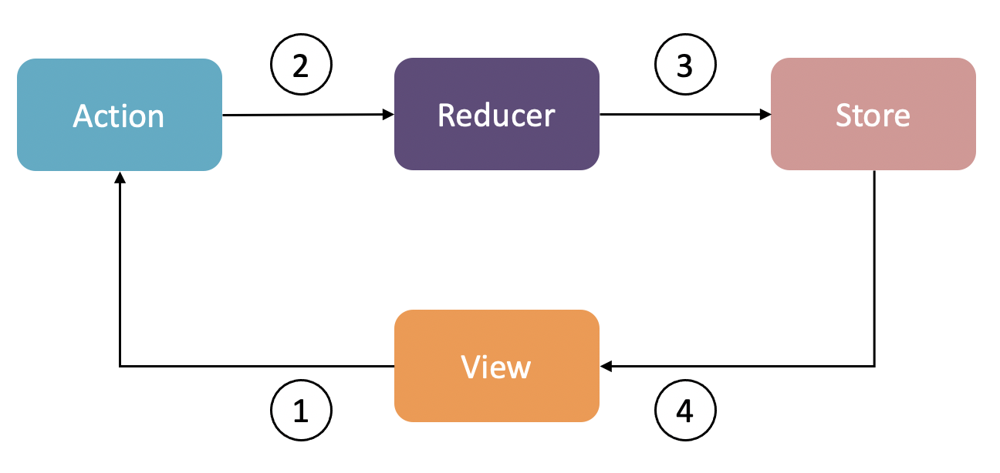

# 在 SwiftUI 中实现 Redux

早些年在编写 React 项目时，就接触过 Redux。先来看看它到底是什么？

## Redux 是什么？

Redux 是为 JavaScript 应用程序编写的可预测状态容器。它把所有程序相关的状态和逻辑中心化，帮助我们编写行为一致（可以理解为UI 显示的数据总是与State 保持一致）的应用。详细了解 Redux，可以访问 [Redux](https://redux.js.org/)。

## Redux 的基本原理

下面是一张 Redux 的工作流程图：



从图中可以看到，Redux 的整个模式由四个组件组成：Store、View、Action 和 Reducer。
- **Store**：持有整个程序的数据（State），在整个程序中只有一个 Store。
- **View**：程序展示给用户的所有 UI 组件，负责与用户交互。
- **Action**：用户对某个 View 的操作而触发的一个行为。例如点击搜索按钮而触发搜索请求，这个搜索请求就是一个 Action。
- **Reducer**：一个纯函数，它接收 Action 和当前 State 作为参数，通过一系列运算，返回一个新的 State。

**Redux 的工作流程**：
1. 用户和 View 交互，产生一个 Action
2. Store 把 Action 派发给 Reducer
3. Reducer 经过运算，返回新的 State 给 Store，通常来说，只在 Reducer 中修改 State
4. Store 通知 View 刷新 UI

## Redux 在 SwiftUI 中的简单实现

SwiftUI 的核心思想跟 React 一样，都是响应式编程。所以我们可以参考 React 的 Redux 实现 SwiftUI 的 Redux。

假设我们正在开发一个非常简单的应用：UI 上显示一个数字 0，每次用户点击按钮，数字就加 1。

### State

首先需要一个 State 来描述应用的数据，定义如下：

```swift
struct AppState {
    var count: Int
    
    init(count: Int = 0) {
        self.count = count
    }
}
```

### Store

```swift
final class Store: ObservableObject {
    @Published private(set) var state: AppState
    
    init(initialState: AppState = .init()) {
        self.state = initialState
    }
}
```

在上面的代码中，把 `Store` 定义为 class 类型，遵循 `ObservableObject` 协议，这样我们就可以通过 SwiftUI 的 `Environment` 特性把唯一的一个 Store 对象注入到根视图中，然后子视图也可以访问 Store 中的 State。`state`  被 `@Published` 标记，它能在 state 发生变化时通知 SwiftUI 刷新 View。

### Action

```swift
enum AppAction {
    case increment
}
```

使用枚举定义 Action。当前例子的需求是每次用户点击按钮，数字就加 1，所以声明一个 action 为 `increment`。

### Reducer
Reducer 是一个纯函数，接收当前 State 和一个 Action 作为参数，并产生一个新的 State。定义如下：

```swift
func appReducer(state: AppState, action: AppAction) -> AppState {
    var newState = state
    switch action {
    case .increment:
        newState.count += 1
    }
    return newState
}
```

### 响应用户的操作

用户对程序的操作触发的 Action 需要通知 Store，Store 接收到 Action 转发给 Reducer。对 Store 类修改如下：

```swift
final class Store: ObservableObject {
    @Published private(set) var state: AppState
    
    private let reducer: Reducer<AppState, AppAction>
    
    init(
        initialState: AppState = .init(),
        reducer: @escaping Reducer<AppState, AppAction>
    ) {
        self.state = initialState
        self.reducer = reducer
    }
    
    func dispatch(_ action: AppAction) {
        state = reducer(state, action)
    }
}
```

### Demo
在 View 中使用如下：

```swift
struct ContentView: View {
    @EnvironmentObject var store: Store
    
    var body: some View {
        VStack {
            Text("\(store.state.count)")
            Button("Add") {
                store.dispatch(.increment)
            }
        }
    }
}
```

完整代码请查看 [GitHub - Lebron1992/IncrementSwiftUI](https://github.com/Lebron1992/IncrementSwiftUI)

## 编写 Redux 库

上面的简单实现只能在当前应用中使用，为了重复使用，可以把它修改优化成一个库。我已经根据上面的例子编写了一个库，并在一个练手的项目中使用。完整代码请查看 [GitHub - Lebron1992/SwiftUIRedux](https://github.com/Lebron1992/SwiftUIRedux)

其中比较难理解的是 Middleware 的相关代码，这里解释一下。

- `Middleware`

```swift
public typealias Middleware = (
    _ dispatch: @escaping Dispatch,
    _ getState: @escaping () -> ReduxState?
) -> (@escaping Dispatch) -> Dispatch
```

这个定义还比较好理解，它就是一个闭包类型，接收两个参数，返回值类型为 `(@escaping Dispatch) -> Dispatch`。

- `asyncActionMiddleware`

```swift
public let asyncActionMiddleware: Middleware = { dispatch, getState in
    { next in
        { action in
            if let action = action as? AsyncAction {
                action.async(dispatch: dispatch, state: getState())
            }
            return next(action)
        }
    }
}
```

这个代码第一眼看上去就晕了，我们一步步来看：
1. 首先 `asyncActionMiddleware` 是一个 `Middleware` 类型，所以 `dispatch, getState` 就是对应 `Middleware` 的两个参数， `{ next in ... }` 的类型就是 `(@escaping Dispatch) -> Dispatch` 
2. 对 `{ next in ... }`  继续分解： `next` 就是 `(@escaping Dispatch)` 所以 `next`的类型是 `Dispatch`；用 `...` 省略的代码的类型也是 `Dispatch`，即下面的代码块是 `Dispatch`：

```swift
{ action in
    if let action = action as? AsyncAction {
        action.async(dispatch: dispatch, state: getState())
    }
    return next(action)
}
```

3. `Dispatch`是 `(Action) -> Void`，对上面的代码块继续分解：这里很好理解，`action` 就是 `Action` 类型，如果发现 `action` 是 `AsyncAction` 类型，就调用它的 `async` 方法，然后调用 `next(action)` 继续派发 `action`。

- 对 `middlewares` 的处理

```swift
public init(
    initialState: S,
    reducer: @escaping Reducer<S>,
    middlewares: [Middleware] = [asyncActionMiddleware]
) {
    self.state = initialState
    self.reducer = reducer
    self.dispatch = middlewares
        .reversed()
        .reduce(
            { [weak self] in self?._dispatch(action: $0) },
            { dispatch, middleware in
                middleware(
                    { [weak self] in self?.dispatch(action: $0) },
                    { [weak self] in self?.state }
                )(dispatch)
            }
        )
}
```

`middlewares.reversed().reduce()` 这里也是比较复杂。`reversed` 是对数组进行反转，为什么要反转，我们暂时跳过，后面有详细解释。先看 `reduce`。

`reduce` 是数组上的一个函数，它的定义如下：

```swift
func reduce<Result>(_ initialResult: Result, _ nextPartialResult: (Result, Element) throws -> Result) rethrows -> Result
```

接收一个初始值和一个闭包（接收上一次迭代的累计的结果和当前迭代的元素作为参数）参数，最后返回一个最终累计的结果。

以求一个整数组的和为例：

```swift
let numbers = [1, 2, 3, 4]
let numberSum = numbers.reduce(0, { x, y in
    x + y
})
// numberSum == 10
```

再回到 `middlewares` 的 `reduce`：

```swift
reduce(
    { [weak self] in self?._dispatch(action: $0) },
    { dispatch, middleware in
        middleware(
            { [weak self] in self?.dispatch(action: $0) },
            { [weak self] in self?.state }
        )(dispatch)
    }
)
```

首先 `Store` 的 `dispatch` 属性是一个 `Dispatch` 类型，所以 `reduce` 的返回值必须是一个 `Dispatch`，那么 `reduce` 的第一个参数初始值也必须是 `Dispatch` 类型，为 `{ [weak self] in self?._dispatch(action: $0) }`，这里调用的是`func _dispatch(action: Action)` 而不是 `func dispatch(action: Action)`，因为带下划线的 dispatch 方法是在经过所有 Middleware 之后最后调用的方法，最终更新 State 的方法。

`reduce` 的第二个参数是闭包，闭包接收两个参数：1）上一次迭代累计的初始值，也就是 `Dispatch` 类型，第二个是当前迭代的元素 `Middleware` 类型，闭包的返回值也必须是 `Dispatch` 类型。闭包如下：

```swift
{ dispatch, middleware in
    middleware(
        { [weak self] in self?.dispatch(action: $0) },
        { [weak self] in self?.state }
    )(dispatch)
}
```

`middleware` 接收两个参数：1）`Dispatch`；2）`() -> ReduxState?`。第一各参数传的是 `{ [weak self] in self?.dispatch(action: $0) }`，实际调用的是 `self.dispatch(action)`；第二个参数传的是 `{ [weak self] in self?.state }` 返回当前的 state。`middleware` 的返回值类型是 `(@escaping Dispatch) -> Dispatch`， 所以把它的返回值当做函数，传入 `dispatch` 参数。

最终 `reduce` 产生的结果就是多个 `Middleware` 嵌套，最后执行 `func _dispatch(action: Action)` 方法。

为什么在 `reduce` 之前要先调用 `reversed`？我们举个例子，假设 `middlewares` 的值为 `[middleware1, middleware2]`，直接调用 `reduce`，不调用 `reversed`。

`middleware1` 和 `middleware2` 如下，这两个 `middlewares` 只是打印了他们自己的名字：

```swift
public let middleware1: Middleware = { dispatch, getState in
    { next in
        { action in
            print("middleware1")
            return next(action)
        }
    }
}

public let middleware2: Middleware = { dispatch, getState in
    { next in
        { action in
            print("middleware2")
            return next(action)
        }
    }
}
```

**调用 reduce**

1. 首先迭代 `middleware1`
	- `dispatch` 参数为初始值：`{ [weak self] in self?._dispatch(action: $0) }`
	- `middleware` 参数为 `middleware1`
	- 执行 `middleware(...)(dispatch)`，把参数代入`middleware1`，得到的返回值为：
```swift
{ action in
    print("middleware1")
    return next(action)
}
```
其中 `next` 是 `{ [weak self] in self?._dispatch(action: $0) }`

2. 迭代 `middleware2`
	- `dispatch` 参数为上一次迭代的返回值，请看上面的返回值
	- `middleware` 参数为 `middleware2`
	- 执行 `middleware(...)(dispatch)`，把参数代入 `middleware2`，得到的返回值为：
```swift
{ action in
    print("middleware2")
    return next(action)
}
```
其中 `next` 是上一次迭代的返回值。

3. `reduce` 执行完毕
现在 `reduce` 执行完毕，所以最后迭代的 `middleware2` 得到的返回值就是 `Store` 的 `dispatch` 属性的值

4. 派发一个 `Action`
调用 `store.dispatch(action: actionA)`，实际就是把 `actionA` 参数传给第二步得到的返回值，调用如下：

```swift
{ actionA in
    print("middleware2")
    return next(actionA)
}
```

其中 `next` 是第一步得到的返回值，可以看到 `print("middleware2")` 先被执行。接着执行 `next`，调用如下：

```swift
{ actionA in
    print("middleware1")
    return next(actionA)
}
```

其中 next 是 `{ [weak self] in self?._dispatch(action: $0) }`，可以看到 `print("middleware1")` 被执行，最后执行 `next(actionA)`，也就是执行 `store._dispatch(action: actionA)`， 触发 `state` 更新。

总结：`middleware2` 先打印，`middleware1` 后打印，这就是为什么要先调用 `reversed`的原因，以保证中间件被执行的顺序跟 `middlewares` 数组的元素顺序相同。
